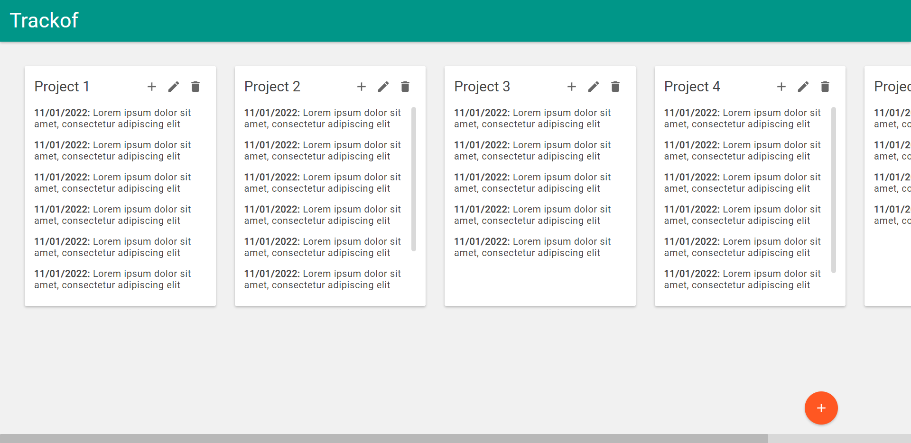

## Trackof

App to keep track of what you've done on a project.



## How to run

Inside `client` folder:

```
> npm install
> npm run serve
```

Inside `server` folder:

```
> npm install
> npx knex migrate:latest
> npm start
```
